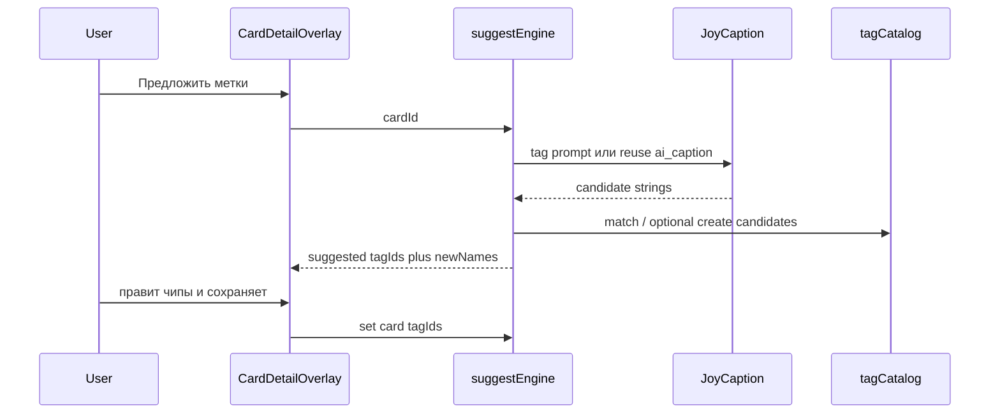
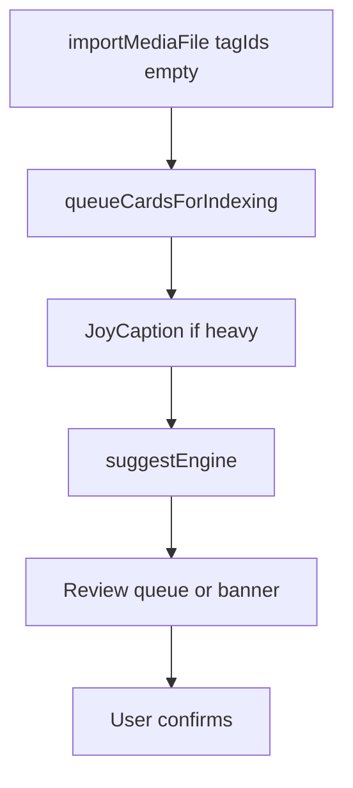

# Автотегирование в ARC — исследование

**Дата:** 2026-07-19  
**Задача AnyType:** «Автотегирование»  
**Ветка:** `auto-tagging`  
**Ограничение итерации:** только исследование и продуктовые рекомендации — **без кода продукта**.

Связанный документ: [local-agent-research.md](./local-agent-research.md).

---

## 1. Executive summary

### Цель

Понять, как ARC может **предлагать метки по содержимому медиафайла**, опираясь на уже скачиваемые модели (JoyCaption, CLIP), без обязательного расширения каталога моделей, с контролем дублей и объёма меток.

### Что есть сегодня

| Слой | Факт |
|------|------|
| JoyCaption (heavy) | Пишет связный абзац в `cards.ai_caption` + FTS; промпт захардкожен |
| CLIP (light / hybrid) | Эмбеддинги изображения и текста для поиска |
| Метки | Каталог `tags` + `card_tags`; назначение вручную или через MCP `arc_set_card_tags` |
| AI-настройки | Вкл. поиска, tier, ресурсы, **точность поиска** (`aiSearchStrictness`) |
| Автотег / suggest | **Отсутствует** в UI, IPC, indexer и MCP |

Метки участвуют в AI только как **буст поиска** (`tagsBoost`), не как выход индексации.

### Главный вывод

Отдельной «модели тегов» в продукте нет и **не нужна для MVP**. Реалистичный путь:

1. JoyCaption с **отдельным tag-prompt** (или второй проход поверх caption) → кандидаты-строки.
2. **Сопоставление с каталогом** пользователя (exact → fuzzy / CLIP cosine по именам).
3. UI **review**: пользователь подтверждает или правит — запись в `card_tags` только после согласия.

Полноценный auto-tag **зависит от heavy tier** (JoyCaption). Light-only — слабый fallback; в продукте это нужно честно показать.

### Рекомендации (приоритет)

| # | Рекомендация | Усилия | Ценность |
|---|--------------|--------|----------|
| 1 | **Suggest-only engine** на JoyCaption + match к каталогу | M | Высокая — ядро фичи без новых моделей |
| 2 | **Два UX:** кнопка в деталке + предложения после импорта | M–L | Высокая — покрывает оба сценария из задачи |
| 3 | **Уровни объёма** меток (паттерн как у точности поиска) | S | Средняя — контроль «меньше / баланс / больше» |
| 4 | **Категория «Автоматически созданные метки»** | S | Средняя — не ломает пользовательскую таксономию |
| 5 | MCP `arc_suggest_card_tags` + prompt | S | Средняя — агенты без дублирования логики |
| 6 | Отдельная HF tag-модель (WD14 и т.п.) | L+ | Только если JoyCaption+match не тянет качество |
| 7 | Fine-tune / тренировка на библиотеке | L+ | **Не для v1–v2** |

### Статус реализации

| Фаза | Статус |
|------|--------|
| 0 Research | Готово (`docs/ai/auto-tagging-research.md`) |
| 1 MVP suggest (деталка, reuse only) | Готово |
| 2 Импорт + create | Готово — отдельный пункт «Автотегирование», `reuse_create`, автотег после heavy-индексации |
| 3 Polish / MCP | Готово — `arc_suggest_card_tags`, prompt `suggest_tags`, [mcp-agent-playbook.md](./mcp-agent-playbook.md) |
| 4A WD14 eval | Готово (desk) — [wd14-vs-joycaption-eval.md](./wd14-vs-joycaption-eval.md); WD **не** в продукт |
| 4C Видео | Готово — до 3 кадров ffmpeg → тот же suggest; кнопка в деталке; автотег после импорта видео |
| 4B Feedback accept/reject | Не начата |

---

## 2. Инвентаризация текущего стека

### 2.1 Модели

Источник правды по моделям: [local-agent-research.md](./local-agent-research.md) §2, `MODEL_CATALOG` в `src/main/ai/types.ts`.

| Модель | Роль сейчас | Для автотега |
|--------|-------------|--------------|
| **JoyCaption Beta One** | Vision→текст, русский абзац | **Основной генератор кандидатов** (новый prompt) |
| **CLIP ViT-B/32** | Embeddings image/text | **Match** имён кандидатов к именам меток; visual similarity как опциональный сигнал |
| **Qwen3-VL-Embedding** | Legacy, вне pipeline | Не использовать |
| **opus-mt-ru-en** | RU→EN для CLIP-запросов | Косвенно при embedding имён меток |

Промпт индексации (`JOYCAPTION_INDEX_PROMPT` в `llamaCppBridge.ts`):

> «Напиши описательную подпись к этому изображению на русском языке. Опиши предмет, цвета, композицию, стиль и настроение одним связным абзацем.»

Это **не** список меток. Для автотега нужен отдельный prompt (и/или парсинг уже сохранённого `ai_caption`).

### 2.2 Индексация и импорт

Heavy path (`indexer.ts`):

1. JoyCaption → `upsertCardAiCaption` / FTS  
2. CLIP hybrid: visual + caption(+существующие имена меток) → `card_embeddings`

После импорта (все пути: IPC, auto-import, Import API, MCP) вызывается `queueCardsForIndexing` — карточка создаётся с **`tagIds: []`**.

**Hook-точки для будущего suggest:**

| Место | Зачем |
|-------|--------|
| После heavy caption в indexer | Уже есть текст/картинка в процессе |
| Отдельная очередь post-index | Не блокировать поиск и caption |
| On-demand IPC из деталки | Кнопка «Предложить метки» |
| Конец `importMediaFile` / после indexing | Импортный сценарий |

Единственный `llama-server` session уже конкурирует с индексацией (см. local-agent research §3.3, on-demand describe). Suggest должен **вставать в ту же очередь приоритетов**, что и caption.

### 2.3 Каталог меток

| Правило | Реализация |
|---------|------------|
| Имя метки глобально уникально | `normalizeNameForCompare` = `trim().toLowerCase()` в `tagCatalogService.ts` и renderer `categories.ts` |
| У метки обязателен `categoryId` | Uncategorized-тегов нет |
| Запись на карточку | Полная замена списка `tagIds` (`syncCardRelations` / `arc_set_card_tags`) |
| UI | `CardDetailTagsModal` — ручной toggle чипов; suggest нет |
| Категория «Автоматически созданные метки» | **Не зашита** — создавать при первом create-режиме |

### 2.4 Настройки AI (куда ляжет toggle)

`SettingsAiSearchPanel.tsx` / prefs в `appPreferences.ts`:

- `aiSemanticSearchEnabled`
- `aiModelTier`, ресурсы
- `aiSearchStrictness` (0–100, шаг 5) — **паттерн слайдера для объёма меток**
- Блок индексации

Флагов auto-tag **нет**.

### 2.5 MCP сегодня

| Инструмент / prompt | Связь с метками |
|---------------------|-----------------|
| `arc_list_tags`, `arc_list_tags_by_category`, CRUD | Каталог |
| `arc_set_card_tags` | Полная замена меток на карточке |
| `arc_get_card`, media resources | Контекст для внешнего LLM |
| Prompt `organize_imports` | «Предложи метки и коллекции… спроси подтверждение» |
| Suggest API | **Нет** |

Внешний агент **уже может** размечать библиотеку через vision LLM клиента + MCP. In-app auto-tag нужен тем, кто работает без Cursor/Claude.

---

## 3. Рынок и ориентиры (не зависимости)

### 3.1 Eagle — AI Autotagger

[Плагин AI Autotagger](https://community-en.eagle.cool/plugin/4B56113D-EB3E-4020-A82C-6214FA08CB14?categoryId=1) (Davey Barker):

- BYOK / локально (Ollama, LM Studio) — **не** встроенная модель продукта.
- **Presets и правила**: что генерировать (tags / names / descriptions), merge vs replace, fixed list vs free tags.
- Batch по выделению, skip-tag «уже обработано», видео по нескольким кадрам.
- Гибкость высокая; цена — облако или отдельный локальный VLM.

**Уроки для ARC:**

- Пользовательский контроль инструкций ценен, но для MVP достаточно двух режимов каталога (reuse / reuse+create) + уровней объёма.
- ARC: **merge** с ручными метками обязателен; отдельный skip-tag на карточке **не делаем**.
- ARC выигрывает **офлайн-приватностью** на уже установленных JoyCaption/CLIP без BYOK.

### 3.2 Habr / общие подходы

Типичный pipeline vision-tagging: VLM или классификатор → список тегов → нормализация → запись в метаданные. Для русскоязычных референсов важны **язык меток** и **пользовательская таксономия**, а не только booru-словарь.

### 3.3 Hugging Face — специализированные taggers

Примеры: **WD14 / SmilingWolf** (`wd-vit-tagger-v3`, SwinV2 и др.) — ONNX, booru-стиль (anime/illustration), пороги confidence, batch CLI/ComfyUI.

| Плюсы | Минусы для ARC |
|-------|----------------|
| Быстрый batch, стабильный словарь | Англ. booru-теги ≠ категории пользователя |
| Зрелый ONNX ecosystem | Новая модель + runtime (~сотни МБ+) |
| Хорош для anime/illustration | Слабее для UI-скринов, фотопродукта, смешанных референсов |

**Вердикт:** держать как **план B**, если JoyCaption+match даёт шум или слишком медленно. В MVP **не тащить**.

### 3.4 Конкуренты (логика, не фичи)

Референс-менеджеры с AI обычно либо (а) облачный VLM + свои теги, либо (б) локальный классификатор с фиксированным словарём. ARC ближе к (а) на локальном JoyCaption, но с **жёсткой привязкой к каталогу пользователя** — это дифференциатор.

---

## 4. Целевые UX-сценарии

Оба сценария в scope будущей реализации. Принцип **v1: только предложения, не тихое автоприменение**.

### 4.1 Настройки (общий вход)

Предполагаемые prefs (имена рабочие):

| Pref | Смысл |
|------|--------|
| `aiAutoTagEnabled` | Вкл. автотег (нужен heavy + AI search enabled) |
| `aiAutoTagCatalogMode` | `reuse` \| `reuse_create` |
| `aiAutoTagVolume` | `fewer` \| `balanced` \| `more` (или 0–100 как strictness) |
| `aiAutoTagOnImport` | Предлагать после импорта (подфича при enabled) |

UI: отдельный пункт **Настройки → Автотегирование** (не внутри AI Поиск). **Макетов Figma нет** — собирать из UI-Kit / существующих паттернов настроек и деталки; правки по месту после смока.

### 4.2 Сценарий A — деталка: «Предложить метки»

- Точка входа: секция «Метки» в деталке (рядом с «Добавить метку») или опции preview bar — по паттернам DS (`btn`, `CardDetailTagsModal`), без отдельного макета.
- Результат: открытие picker с **предвыбранными** чипами + пометкой «новые» (если create-режим).
- **Merge:** предложения **дополняют** уже назначенные ручные метки (union), не заменяют их; пользователь может снять лишние чипы перед сохранением.
- Сохранение — существующий `updateCard` / `tagIds`.

### 4.3 Сценарий B — после импорта

- Фоновый suggest **после** caption (или в том же heavy-шаге вторым prompt — дороже по времени).
- UI: не молча писать метки. Варианты review (выбрать один в реализации):
  1. Очередь «Предложения меток» (N карточек) — лучше для batch.
  2. Toast / баннер «Есть предложения» → открыть деталку/picker.
  3. При одиночном импорте — сразу открыть picker с suggestions.
- При уже заполненных метках — тот же **merge** (suggestions ∪ текущие `tagIds`), без замены.
- Отдельный skip-tag / флаг «не предлагать снова» на карточке **не нужен** (решение продукта).

### 4.4 Четыре пути из задачи AnyType → сведение

| # в задаче | Режим каталога | Триггер | В ARC v1 |
|------------|----------------|---------|----------|
| 1 | reuse | импорт | Да (suggest + review) |
| 2 | reuse | деталка | Да |
| 3 | reuse+create | импорт | Да (новые → «Автоматически созданные метки») |
| 4 | reuse+create | деталка | Да |

Тихое автоприменение без review **не рекомендуется** в v1 даже при «включённом автотеге».

---

## 5. Алгоритм suggest engine

### 5.1 Источник кандидатов

**Предпочтительный путь (heavy):**

1. Отдельный JoyCaption prompt, например:  
   «Перечисли 5–15 коротких меток на русском через запятую: объект, жанр, стиль, настроение. Без предложений. Не дублируй синонимы.»  
   Число меток зависит от уровня объёма.
2. Парсинг CSV/строк → нормализация.

**Альтернатива дешевле по времени:** reuse `ai_caption` + лёгкий extract (второй короткий prompt «выдели метки из текста» или heuristic NLP). Качество ниже; годится как fallback, если caption уже есть.

**Light-only:** не обещать полноценный auto-tag. Варианты: disabled UI с пояснением «нужна тяжёлая модель» или очень слабый match «похожие карточки → пересечение их меток» (эксперимент, не MVP).

### 5.2 Сопоставление с каталогом

Порядок:

1. `normalizeNameForCompare` — exact hit → существующий `tagId`.
2. Подстрока / токенное пересечение (осторожно с короткими словами).
3. CLIP text embedding кандидата vs эмбеддинги **имён** всех меток (кэш эмбеддингов каталога) — cosine ≥ порога → reuse.
4. Если `reuse_create` и нет match — кандидат на **новую** метку в категорию **«Автоматически созданные метки»**.
5. Если `reuse` и нет match — отбросить кандидата.
6. Итог для UI/сохранения: `suggested ∪ existingTagIds` (**merge**), без удаления уже стоящих меток.

### 5.3 Дедуп сущностей (обязательное условие задачи)

Проблема: «портрет», «женский портрет», «портрет женщины»…

Меры:

| Слой | Действие |
|------|----------|
| Prompt | Явно запретить синонимы и уточнения одного понятия |
| Match threshold | При create — если cosine к существующей метке ≥ порога, **не создавать**, а reuse |
| Канон | Предпочитать более короткое / уже существующее имя |
| Каталог | Глобальная уникальность имён уже есть — защищает точные дубли регистра |
| Пост-обработка | Кластеризация предложенных строк между собой до показа UI |

Идеальный «знаниевый» граф синонимов вручную не вести в v1 — достаточно embedding-порогов + prompt.

### 5.4 Уровни объёма

Паттерн UX: как «Точность поиска» (`ValueSlider` + `aiSearchStrictness` / `searchStrictness.ts`).

| Уровень | max кандидатов | min similarity (reuse) | bias create |
|---------|----------------|------------------------|-------------|
| Меньше | 3–5 | выше | почти не создавать |
| Баланс | 6–10 | средний | умеренно |
| Больше | 12–20 | ниже | чаще новые (если режим create) |

Точные числа — калибровка на пилотной библиотеке.

### 5.5 Категория «Автоматически созданные метки»

- Имя категории (решение продукта): **«Автоматически созданные метки»**.
- Создавать при первом `reuse_create`, если нет категории с таким именем (case-insensitive).
- Пользователь переносит метки в свои категории вручную (как сейчас через Tags / TagSettings).
- Не смешивать с коллекцией «Без категории» (это другой объект домена).

---

## 6. MCP и агенты

### 6.1 Уже работает без in-app engine

Внешний LLM + `organize_imports` + `arc_list_tags` + media + `arc_set_card_tags` ≈ ручной auto-tag через агента. Минус: качество и дедуп на стороне промпта агента, не единого engine ARC.

### 6.2 Рекомендация для продукта

| Добавка | Назначение |
|---------|------------|
| `arc_suggest_card_tags` | Read-only: `{ matched: [{tagId, name, score}], proposedNew: [name] }` |
| Prompt `suggest_tags` | Шаблон: предложи → покажи → спроси перед `arc_set_card_tags` |

Агент и UI должны вызывать **один** engine — иначе два разных поведения.

### 6.3 Можно ли «решить задачу только MCP»?

Да, для power users. Нет, как единственный ответ на продуктовую задачу: большинству нужен in-app путь без внешнего клиента.

---

## 7. Тренировка на изображениях библиотеки

| Вопрос | Вердикт |
|--------|---------|
| Нужна ли для v1–v2? | **Нет** |
| Почему | Каталог пользователя + match покрывает reuse; create — из VLM-кандидатов |
| Когда вернуться | Если пользователи массово правят предложения в одну сторону — собирать feedback-сигнал (accept/reject), не full fine-tune |
| Риск fine-tune | Сложность пайплайна, размер модели, drift таксономии, поддержка |

---

## 8. Фазы будущей реализации

Оценка усилий: S / M / L относительно текущего стека ARC.

### Фаза 0 — исследование (эта итерация)

- Документ `docs/ai/auto-tagging-research.md`
- Код продукта не меняется

### Фаза 1 — MVP suggest (M)

- Engine: JoyCaption tag-prompt + exact/CLIP match, режим **reuse only**
- UI: кнопка «Предложить метки» в деталке + review в picker
- Pref: `aiAutoTagEnabled` + объём
- Зависимость: heavy модель установлена
- MCP: опционально `arc_suggest_card_tags` в той же фазе или сразу после

**Готово когда:** на карточке с heavy-индексом кнопка даёт осмысленный список; merge с ручными метками; UI на DS, смок и точечная правка.

### Фаза 2 — импорт + create (M–L)

- Очередь suggestions после импорта / indexing
- Режим `reuse_create` + категория **«Автоматически созданные метки»**
- Merge с уже назначенными метками (не replace)
- Дедуп-пороги по объёму
- **Только изображения** — видео отложено

**Готово когда:** batch-импорт не спамит; review очереди понятен; дубли «портрет*» редки на тестовой библиотеке.

### Фаза 3 — polish (S–M)

- Калибровка порогов, тексты empty/error, пауза при занятости llama-server
- Prompt-тюнинг JoyCaption
- Документация MCP playbook

### Фаза 4 — опционально (L+)

- Оценка WD14 / иного HF tagger — **desk research**: [wd14-vs-joycaption-eval.md](./wd14-vs-joycaption-eval.md); в продукт не берём
- Feedback-loop accept/reject — **не начата**
- **Видео** (до 3 кадров / fallback thumb) — **готово** в том же engine

---

## 9. Риски

| Риск | Влияние | Митигация |
|------|---------|-----------|
| Contention `llama-server` | Suggest тормозит индекс / поиск | Общая очередь, приоритет navigation IPC (как сейчас) |
| Только light tier | Нет качественного vision→tags | UI: фича недоступна или честный fallback |
| Шум и дубли меток | Захламление каталога | Suggest-only; высокие пороги; «Автоматически созданные метки»; prompt anti-synonym |
| Массовый импорт | Сотни review | Очередь, batch accept, лимит concurrent |
| Русский язык меток | CLIP слабее на кириллице | opus-mt для embedding имён; exact match на русском в приоритете |
| Нет макета Figma | UI-риск | Собирать из UI-Kit; править после смока |
| Ожидание «тихого» автотега | Расхождение с v1 | Copy в настройках: «предложения, вы подтверждаете» |

---

## 10. Продуктовые решения (зафиксировано 2026-07-19)

| # | Вопрос | Решение |
|---|--------|---------|
| 1 | Макеты Figma | **Нет.** UI из готовой дизайн-системы; правки по необходимости после смока |
| 2 | Имя категории для новых меток | **«Автоматически созданные метки»** |
| 3 | Уже есть ручные метки | **Merge** — suggestions дополняют текущий список, не заменяют |
| 4 | Skip-tag / «не предлагать снова» | **Не нужен** |
| 5 | Видео | **Поддержано (фаза 4C):** до 3 кадров через ffmpeg → JoyCaption; fallback `thumb_l`. Heavy-индексация эмбеддингов по-прежнему только для изображений |

---

## 11. Ключевые файлы (для будущей реализации)

| Область | Путь |
|---------|------|
| Caption / prompt | `src/main/ai/llamaCppBridge.ts`, `joyCaption.ts` |
| Indexer | `src/main/ai/indexer.ts` |
| Embeddings | `src/main/ai/aiEmbeddingService.ts`, `cardEmbeddings.ts` |
| Prefs | `src/main/appPreferences.ts` |
| AI settings UI | `renderer/src/pages/settings/panels/SettingsAiSearchPanel.tsx` |
| Метки UI | `CardDetailOverlay.tsx`, `CardDetailTagsModal.tsx` |
| Каталог | `tagCatalogService.ts`, `libraryStorage.ts` |
| MCP | `cardTools.ts`, `catalogTools.ts`, `registerPrompts.ts` |
| Импорт hooks | `ipcStorage.ts`, `autoImportWatcher.ts`, `importService.ts` |
| Strictness pattern | `searchStrictness.ts`, `ValueSlider.tsx` |

---

## 12. Итог одной фразой

**Автотегирование в ARC — это suggest-слой поверх JoyCaption и каталога меток с обязательным review, двумя триггерами (деталка и импорт), без новой модели и без обучения на библиотеке в первых версиях; MCP усиливает тот же engine для внешних агентов.**
