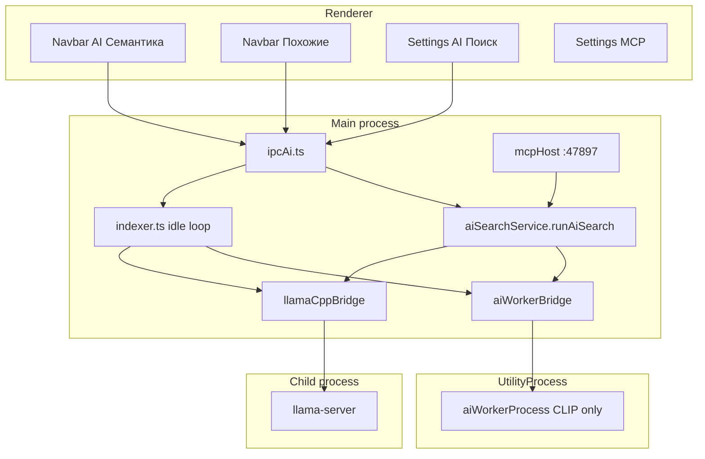
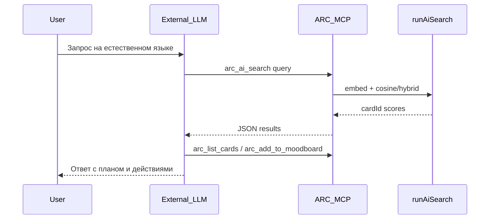

# Локальный агент в ARC — исследование

**Дата:** 2026-07-06  
**Задача AnyType:** «Локальный агент»  
**Ограничение:** только уже скачиваемые модели — CLIP (light), JoyCaption (heavy), Qwen3-VL-Embedding (legacy).

---

## 1. Executive summary

### Что ARC умеет с AI сегодня

ARC реализует **локальный семантический и визуальный поиск** по библиотеке референсов:

- **Индексация** — фоновое построение embeddings и (для heavy) подписей к изображениям.
- **Поиск в UI** — режимы «AI Семантика» и «Похожие» в navbar.
- **MCP-сервер** — 53 инструмента на `http://127.0.0.1:47897/mcp` для внешних AI-агентов (Cursor, Claude Desktop и т.п.).

Встроенного чат-ассистента или диалоговой LLM в приложении **нет**.

### Главный вывод

Ни CLIP, ни JoyCaption, ни Qwen3-VL-Embedding **не являются диалоговыми языковыми моделями**. На их основе реалистичный «локальный агент» — это:

- **retrieval** (поиск по смыслу и похожести),
- **vision-describe** (одноходовое описание картинки),
- **tool provider** (MCP для внешнего LLM),

а не полноценный ChatGPT внутри ARC.

### Рекомендации (приоритет)

| # | Рекомендация | Усилия | Ценность |
|---|--------------|--------|----------|
| 1 | **MCP playbook** — документация настройки Cursor-агента для ARC | S | Высокая, работает уже сейчас |
| 2 | **In-app Search Assistant** — UI-панель поверх `runAiSearch` без LLM-чата | M | Средняя, «агент» внутри ARC без новых моделей |
| 3 | **On-demand describe** — кнопка «Опиши» через JoyCaption по запросу | M | Средняя, переиспользует heavy runtime |
| 4 | **Оценка возврата Qwen** — A/B с CLIP на реальных библиотеках | L | Неясная без бенчмарка |
| 5 | **Полноценный in-app chat** — отдельная задача, потребует text-LLM | L+ | Высокая, но **вне scope** текущих моделей |

---

## 2. Инвентаризация моделей

Корень артефактов: `{userData}/models/` (Electron `app.getPath('userData')`).  
Manifest установки: `{userData}/models/ai-models-manifest.json`.

### 2.1 CLIP — light tier

| Параметр | Значение |
|----------|----------|
| ID | `clip-vit-base-patch32` |
| HF repo | `Xenova/clip-vit-base-patch32` |
| Стек | `transformers` (`@xenova/transformers`) |
| Формат | Quantized ONNX/bin |
| Размер | ~350 МБ |
| Min RAM | 2048 МБ |
| Путь | `{userData}/models/transformers/Xenova/clip-vit-base-patch32/` |
| Runtime | Electron **UtilityProcess** (`aiWorkerProcess.ts`, `serviceName: 'arc-ai-worker'`) |
| Когда грузится | Индексация light; поиск light; hybrid heavy (visual + caption embeddings) |

**API в коде:**

- Worker: `embed-image`, `embed-text` (`aiWorkerBridge.ts`)
- Поиск: `embedTextForTier` → `prepareSearchQuery` (RU→EN + шаблон `a photo of …`) → `searchByEmbedding`
- Hybrid: `embedHeavyHybridForIndex`, `embedHeavyHybridQuery` — CLIP используется и для heavy

**Возможности:** embeddings изображения и текста.  
**Ограничения:** нет генерации текста, нет диалога.

### 2.2 JoyCaption — heavy tier

| Параметр | Значение |
|----------|----------|
| ID | `joycaption-beta-one` |
| HF repo (weights) | `mradermacher/llama-joycaption-beta-one-hf-llava-GGUF` |
| HF repo (mmproj) | `concedo/llama-joycaption-beta-one-hf-llava-mmproj-gguf` |
| Стек | `llama-caption` |
| Формат | GGUF Q4_K_M (weights) + f16 mmproj |
| Размер | ~5.5 ГБ |
| Min RAM | 12288 МБ |
| Путь | `{userData}/models/llama/` |
| Runtime | **llama-server** (child process), режим `chat` |
| Когда грузится | Индексация heavy (caption per card); тест загрузки в настройках |

**Дополнительно скачивается llama.cpp runtime** (не в MODEL_CATALOG):

| Вариант | Размер | Платформы |
|---------|--------|-----------|
| CPU | ~80 МБ | win32-x64, darwin-arm64, darwin-x64 |
| CUDA 12.4 | ~450 МБ | win32-x64 |

Release: `b8390` (`llamaRuntimeCatalog.ts`). **Linux не поддерживается** для llama-runtime.

**API в коде:**

- `generateJoyCaption` → `captionImageViaServer` → `POST /v1/chat/completions`
- Фиксированный промпт `JOYCAPTION_INDEX_PROMPT` (русский, описательный абзац)
- `max_tokens`: 1024

**Возможности:** одноходовое vision-to-text (описание изображения).  
**Ограничения:** не свободный чат; промпт захардкожен; конкурирует с индексацией за единственный `llama-server` session.

При установке heavy UI **автоматически докачивает light CLIP** (`ensureLightClipForHybrid`) — heavy = hybrid pipeline.

### 2.3 Qwen3-VL-Embedding — legacy (medium tier)

| Параметр | Значение |
|----------|----------|
| ID | `qwen3-vl-embedding-2b` |
| HF repo | `DevQuasar/Qwen.Qwen3-VL-Embedding-2B-GGUF` |
| Стек | `llama-embed` |
| Формат | GGUF Q4_K_M + f16 mmproj |
| Размер | ~2.5 ГБ |
| Min RAM | 8192 МБ |
| Путь | `{userData}/models/llama/` (те же файлы, другие имена) |
| Runtime | llama-server (`embed` mode) или `node-llama-cpp` embedding context |
| Статус в продукте | **Удалён из `MODEL_CATALOG` и UI** |

**Код:** `qwenVlEmbedding.ts` — помечен как *«kept for optional migration tooling»*.

**Факты:**

- `sanitizeTier('medium')` в `ipcAi.ts` мигрирует на `'heavy'`.
- Функции `embedQwenImage` / `embedQwenText` **не вызываются** из indexer, search или UI.
- Скачивание через настройки **невозможно** — только ручное размещение файлов или legacy-артефакты.
- Smoke-test `scripts/verify-ai-models.mjs` всё ещё проверяет medium tier.

**Возможности:** embeddings image + text (multimodal).  
**Ограничения:** нет генерации; не в продуктовом pipeline; потенциальная конкуренция с JoyCaption за `llama-server` и диск в `{userData}/models/llama/`.

### 2.4 Вспомогательная модель: opus-mt-ru-en

| Параметр | Значение |
|----------|----------|
| HF repo | `Xenova/opus-mt-ru-en` |
| Назначение | Перевод кириллических запросов для CLIP |
| Путь | `{userData}/models/transformers/` (кэш transformers) |
| Роль в «агенте» | Инфраструктурная, не пользовательская фича |

---

## 3. Как модели участвуют в продукте

### 3.1 Архитектура

### 3.2 Light path (CLIP)

1. Пользователь включает AI в настройках, скачивает light модель.
2. **Индексация** (idle через 15 с, batch 8): worker embed image → `card_embeddings`.
3. **Поиск:** запрос → `prepareSearchQuery` (перевод + CLIP template) → embed text → cosine search (`semanticSearch.ts`).
4. UI: галерея с результатами, score в URL/cache.

### 3.3 Heavy path (JoyCaption + CLIP hybrid)

1. Скачивание: GGUF JoyCaption + llama-runtime + auto-download CLIP.
2. **Индексация** (batch 1, медленно):
   - JoyCaption → русская подпись → `cards.ai_caption` + FTS
   - CLIP → visual embedding (`::visual`) + caption embedding (`::caption`)
3. **Поиск:** dual query vectors → fusion (`hybridSearch.ts`, weights visual 0.55 / caption 0.45 / tags boost 0.12).
4. Приоритет navigation IPC над индексацией (`waitForNavigationIpc`).

### 3.4 Qwen path

**Не участвует** в продуктовых flow. Код сохранён для migration tooling и verify-скрипта.

### 3.5 UI-точки

| Экран | Маршрут / файл | Функция |
|-------|----------------|---------|
| AI Поиск (настройки) | `/settings/ai-search`, `SettingsAiSearchPanel.tsx` | Модели, ресурсы, strictness, индексация |
| Navbar AI | `aiMode.tsx` | Семантический запрос → галерея |
| Navbar Похожие | `useSimilarGalleryFeed.ts` | Visual similarity |
| MCP сервер | `/settings/mcp-server` | Toggle сервера, per-tool enable, JSON config |

Видимость AI-режимов navbar: `aiSemanticSearchEnabled && setupReady`.

---

## 4. MCP как существующий «агентный слой»

### 4.1 Сервер

- URL: `http://127.0.0.1:47897/mcp`
- Протокол: HTTP Streamable MCP (`@modelcontextprotocol/sdk`)
- Доступ: только localhost; 403 если `mcpServerEnabled === false`
- Перезапуск при смене `mcpServerEnabled` / `mcpToolsEnabled`

### 4.2 AI-инструменты (группа `ai`)

| Tool ID | Описание |
|---------|----------|
| `arc_ai_search` | Семантический поиск по запросу → `{ cardId, score }[]` |
| `arc_trigger_reindex` | Запуск полной переиндексации |
| `arc_get_ai_status` | Статус моделей, индекса, ошибок (группа `app`) |

### 4.3 Visual-search инструменты (связаны с AI-индексом)

| Tool ID | Описание |
|---------|----------|
| `arc_similar_search` | Похожие по `cardId` |
| `arc_color_search` | Поиск по HEX (не embedding, но в той же UX-группе) |

### 4.4 Prompt-шаблоны для внешних агентов

| Name | Сценарий |
|------|----------|
| `organize_imports` | Разметка недавнего импорта |
| `build_moodboard` | Подбор референсов на мудборд |
| `find_duplicates` | Поиск и объединение дубликатов |
| `color_palette_review` | Подбор по цвету |
| `library_overview` | Обзор библиотеки без изменений |

### 4.5 Остальные инструменты (контекст для агента)

Всего **54 MCP tools** в 12 группах: карточки (read/write), коллекции, мудборд, каталог меток, фильтры, дубликаты, импорт, приложение.

Write-операции требуют отсутствия maintenance lock; mass-write помечены `MCP_CONFIRM_HINT`.

### 4.6 Ограничение

ARC — **tool provider**. Для диалога, рассуждения и планирования нужен **внешний LLM** (Cursor Agent, Claude и т.п.). Единая точка поиска: `runAiSearch()` — используется и UI, и MCP.

---

## 5. Сценарии «локального агента» без новых моделей

### A. Внешний агент через MCP (уже работает)

**Как:** Cursor + MCP config + prompt template (`build_moodboard`, `organize_imports`, …).

| Критерий | Оценка |
|----------|--------|
| UX | Полноценный диалог на стороне Cursor |
| Техсложность | S — документация и примеры |
| Ценность | Высокая для power users |
| Минус | Не встроенный чат в ARC |

**Готово когда:** есть playbook в docs с примерами `mcp.json`, типовыми промптами и чеклистом включения MCP.

### B. In-app Search Assistant (без LLM-генерации)

**Как:** Панель или расширение navbar: пользователь пишет запрос → `runAiSearch` → галерея + шаблонный ответ («Нашёл N референсов по …»). Опционально: подсказки запросов, история запросов (не диалог).

| Критерий | Оценка |
|----------|--------|
| UX | «Помощник поиска», не чатбот |
| Техсложность | M — UI + reuse `useAiGalleryFeed` |
| Модели | CLIP / hybrid; Qwen — только если вернуть tier |
| Минус | Нет рассуждения и свободных ответов |

**Готово когда:** панель в UI, запросы работают как AI Семантика, есть empty/error states по правилам ARC.

### C. On-demand describe (JoyCaption по кнопке)

**Как:** Кнопка «Опиши» на карточке / в деталке → `generateJoyCaption` с кастомным или дефолтным промптом.

| Критерий | Оценка |
|----------|--------|
| UX | Полезно для неиндексированных или уточнения |
| Техсложность | M — очередь vs индексация, loading state |
| Модели | JoyCaption + llama-server |
| Минус | Один ответ; медленно; блокирует llama-server |

**Готово когда:** describe по запросу с паузой/приоритетом над фоновой индексацией; Figma для кнопки.

### D. Псевдо-агент с intent-паттернами (без LLM)

**Как:** Regex / keyword routing («найди», «похожие на», «добавь в мудборд») → прямой вызов MCP-tools.

| Критерий | Оценка |
|----------|--------|
| UX | Быстро для узкого набора команд |
| Техсложность | M, но хрупко |
| Ценность | Низкая без NLU |
| Вердикт | Не рекомендуется как основной путь |

### E. In-app UI + внешний LLM API (вне scope)

Панель чата в ARC с inference через OpenAI/Ollama API + внутренние tools. **Нарушает** ограничение «только наши модели» — упомянуто как альтернатива для отдельной задачи.

---

## 6. Матрица возможностей и пробелов

| Возможность агента | CLIP | JoyCaption | Qwen | MCP сегодня |
|--------------------|------|------------|------|-------------|
| Семантический поиск | да | косвенно (caption в hybrid) | да (legacy, не в UI) | да |
| Похожие изображения | да | — | да (legacy) | да |
| Описание картинки | — | да | — | через `ai_caption` / card data |
| Диалог / рассуждение | нет | нет | нет | внешний LLM |
| Изменение библиотеки | — | — | — | да (write tools) |
| Streaming ответов | — | — | — | нет в ARC |
| Tool-calling loop | — | — | — | только снаружи |

### Технические пробелы

| Пробел | Влияние |
|--------|---------|
| Нет conversation IPC / history | In-app chat невозможен без нового слоя |
| Нет streaming в renderer | Медленные ответы JoyCaption без progress UX |
| Единый `llama-server` session | Индексация vs interactive describe конфликтуют |
| Qwen не в UI и не в indexer | Модель «мертва» для пользователей |
| Linux без llama-runtime | Heavy/Qwen недоступны на Linux |
| JoyCaption ≠ general chat | Ложные ожидания «чатбота из коробки» |
| Нет Figma для assistant UI | Follow-up UI нужен макет |

---

## 7. Roadmap follow-up задач

### Задача 1: MCP playbook для ARC-агента

- **Усилия:** S (1–2 дня)
- **Содержание:** `docs/ai/mcp-agent-playbook.md` — настройка Cursor, примеры промптов, типовые workflow (мудборд, импорт, дубликаты).
- **Готово когда:** пользователь может повторить setup по документу; проверено на Windows.

### Задача 2: In-app Search Assistant

- **Усилия:** M (3–5 дней)
- **Содержание:** UI-панель поверх `runAiSearch`, история запросов, шаблонные ответы.
- **Готово когда:** Figma согласован; `verify:renderer-ui` зелёный; поведение = AI Семантика + assistant chrome.
- **Зависимости:** макет Figma.

### Задача 3: On-demand JoyCaption describe

- **Усилия:** M (3–5 дней)
- **Содержание:** кнопка в деталке карточки; очередь запросов; приоритет над idle-индексацией.
- **Готово когда:** describe работает на heavy setup; индексация возобновляется после describe.
- **Зависимости:** Figma для кнопки/loading.

### Задача 4: Бенчмарк Qwen vs CLIP

- **Усилия:** L (исследование + скрипт)
- **Содержание:** сравнение качества поиска на тестовой библиотеке; решение о возврате tier в каталог.
- **Готово когда:** отчёт с метриками (precision@k, примеры запросов); рекомендация product.

### Задача 5: Полноценный in-app chat (отдельный epic)

- **Усилия:** L+ (2+ недели)
- **Содержание:** text-LLM в каталоге, streaming IPC, conversation store, tool router.
- **Готово когда:** отдельное ТЗ; **вне scope** текущих трёх моделей.

---

## 8. Ссылки на ключевые файлы

| Область | Путь |
|---------|------|
| Каталог моделей | `src/main/ai/types.ts` |
| Пути на диске | `src/main/ai/modelManager.ts` |
| Manifest | `src/main/ai/modelManifest.ts` |
| CLIP worker | `src/main/ai/aiWorkerProcess.ts` |
| llama-server bridge | `src/main/ai/llamaCppBridge.ts` |
| JoyCaption | `src/main/ai/joyCaption.ts` |
| Qwen legacy | `src/main/ai/qwenVlEmbedding.ts` |
| Индексация | `src/main/ai/indexer.ts` |
| Поиск | `src/main/ai/aiSearchService.ts` |
| Hybrid fusion | `src/main/ai/hybridSearch.ts` |
| IPC | `src/main/ipcAi.ts` |
| MCP host | `src/main/mcp/mcpHost.ts` |
| MCP AI tools | `src/main/mcp/tools/aiTools.ts` |
| MCP prompts | `src/main/mcp/registerPrompts.ts` |
| MCP catalog | `src/main/shared/mcpToolCopy.ts` |
| Настройки AI UI | `renderer/src/pages/settings/panels/SettingsAiSearchPanel.tsx` |
| Navbar AI | `renderer/src/components/layout/navbar-search/modes/aiMode.tsx` |
| Verify script | `scripts/verify-ai-models.mjs` |

---

## Приложение: ответ на вопрос из задачи

> «Понять как можно ещё использовать AI в рамках работы с программой. Например встроить в ARC свой чатбот.»

**Честный ответ:** с текущими моделями **полноценный чатбот внутри ARC невозможен** — нет generative text LLM. Реалистичные варианты:

1. **Сейчас:** внешний агент (Cursor) + MCP — это уже «чатбот для библиотеки», но UI вне ARC.
2. **Ближайшее in-app:** Search Assistant (поиск + шаблоны) и Describe (JoyCaption по кнопке).
3. **Для настоящего чата:** отдельная text-LLM (GGUF или API) — новая модель в каталоге, новый IPC, новый UI.

Qwen может усилить **поиск** (embeddings), но не заменит диалоговую модель.
