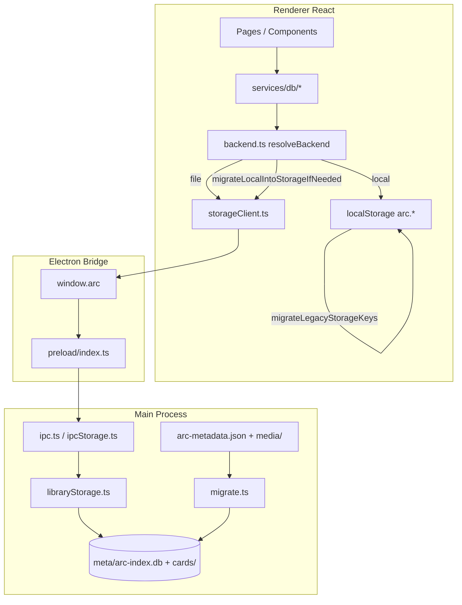
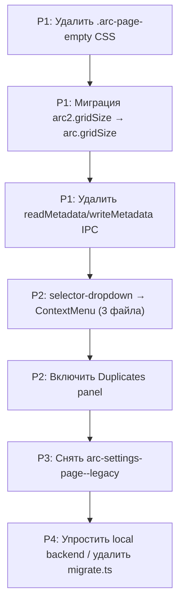

# Аудит взаимодействия нового и старого кода в ARC

**Дата:** 2026-06-29  
**Версия приложения:** 0.1.2  
**Область:** Artist Reference Collection (Electron + React)

---

## Executive summary

ARC — относительно молодой greenfield-проект (~2 месяца), но уже содержит **явные слои перехода** от ранних решений к каноническим паттернам ARC-2. Доминирующая история интеграции — **миграция хранения** (монолитный JSON → SQLite + `cards/`) и **переименование** `arc2` → `arc`. В UI основная борьба — между `selector-dropdown` (старый) и `ContextMenu` (новый).

### Ключевые находки (7)

1. **Dual-backend в renderer** — каждый модуль `services/db/*` ветвится на `file` (IPC) и `local` (localStorage). Это создаёт двойной источник правды при dev без Electron.
2. **Миграция JSON → SQLite** работает автоматически при открытии библиотеки, с IPC-прогрессом `arc:migration-progress`. Откат не предусмотрен — только backup `arc-metadata.backup.json`.
3. **`readMetadata` / `writeMetadata`** — мёртвый IPC API: экспонируется в preload, но **нигде не вызывается** из renderer. Main process отклоняет write при новом формате.
4. **UI-паттерн `selector-dropdown`** остался в 3 продуктовых компонентах (`TagSettingsModal`, `Calendar`, `MoodboardBoardView`), тогда как галерея/метки/коллекции уже на `ContextMenu`.
5. **`.arc-page-empty`** — мёртвый CSS (0 TSX-использований), заменён компонентом `EmptyState`.
6. **`arc2.gridSize`** — единственный localStorage-ключ без автомиграции (остальные 8 пар в `LEGACY_STORAGE_KEY_PAIRS`).
7. **Раздел «Поиск дублей»** — полноценный код панели (`SettingsDuplicatesPanel.tsx`, ~240 строк) скрыт флагом `PANEL_IN_DEVELOPMENT.duplicates = true`; в navbar подпись «— в разработке».

### Quick wins (можно убрать сейчас)

| # | Что | Риск | Файлы |
|---|-----|------|-------|
| 1 | CSS `.arc-page-empty` | Нулевой — 0 использований | `renderer/src/styles/index.css` |
| 2 | IPC `readMetadata` / `writeMetadata` | Низкий — не вызываются из renderer | `preload/index.ts`, `ipc.ts`, `arc-global.d.ts` |
| 3 | Миграция ключа `arc2.gridSize` → `arc.gridSize` | Низкий — одно значение | `gridSizePreference.ts` |

---

## 1. Карта архитектурных стыков

### 1.1 Общая схема потока данных



### 1.2 Entry points (параллельные оболочки)

| Entry | HTML | Назначение | Общий код |
|-------|------|------------|-----------|
| Main app | `renderer/index.html` | Основное приложение | `main.tsx` → `App.tsx` |
| Loading splash | `renderer/loading-screen.html` | Splash при запуске | `loading-screen/main.tsx` |
| Screenshot picker | `renderer/screenshot-picker.html` | Выбор области скриншота | `screenshot-picker/ScreenshotPickerApp.tsx` |
| UI-Kit | `/ui-kit` route | Демо дизайн-системы | `ui-kit/UiKitPage.tsx` |

Все entry points собираются через `renderer/vite.config.ts` (`rollupOptions.input`).

### 1.3 Dual-backend: ветвление по модулям

`resolveBackend()` в [`renderer/src/services/db/backend.ts`](../../renderer/src/services/db/backend.ts) возвращает `'file'` или `'local'`:

| Условие | Backend |
|---------|---------|
| `window.arc` отсутствует | `local` |
| Библиотека не выбрана (`getLibraryPath()` → null) | `local` |
| Библиотека выбрана + `storageEnsureReady()` OK | `file` |

**Модули с ветвлением** (кол-во вызовов `resolveBackend()`):

| Модуль | Вызовов | Поведение local-backend |
|--------|---------|-------------------------|
| `cards.ts` | 13 | Минимальные stub-записи в localStorage; полные данные только через file |
| `backend.ts` | 7 | Инициализация, гидрация, unified read/write |
| `moodboard.ts` | 5 | moodboard IDs + board JSON в localStorage |
| `categories.ts` | 4 | + `migrateCategoriesIfNeededLocal()` |
| `collections.ts` | 3 | + `migrateCollectionsIfNeededLocal()` |
| `library.ts` | 3 | Stub-карточки с `originalRelativePath: 'legacy'` |

### 1.4 Таблица стыков: файл → зависимость → legacy

| Файл | Вызывает | Legacy-зависимость | Направление |
|------|----------|-------------------|-------------|
| `backend.ts` | `LEGACY_STORAGE_KEY_PAIRS` | `arc2.*` → `arc.*` ключи | old → new |
| `backend.ts` | `migrateLocalIntoStorageIfNeeded()` | localStorage → IPC storage | old → new |
| `libraryStorage.ts` | `ensureLibraryFilenamesMigrated()` | `arc2-*` → `arc-*` файлы | old → new |
| `libraryStorage.ts` | `runLegacyMigration()` | JSON → SQLite | old → new |
| `galleryFilterTypes.ts` | `migrateGalleryAdvancedFilters()` | старые duration/resolution presets | old → new |
| `GalleryCardEditRedirect.tsx` | redirect `/gallery/:id/edit` | старый URL редактирования | old → new |
| `gridSizePreference.ts` | `arc2.gridSize` | **без миграции** | old (holdover) |
| `galleryMediaCache.ts` | `rel === 'legacy'` | placeholder пути | sentinel |
| `storageClient.ts` | `window.arc.storage*` | фасад над IPC | bridge |
| `DemoAlert.tsx` | re-export `ToastAlert` | старое имя | alias |

---

## 2. Аудит слоя хранения данных

### 2.1 Миграция JSON → SQLite

**Триггер:** `ensureLibraryReadyInner()` в [`src/main/storage/libraryStorage.ts`](../../src/main/storage/libraryStorage.ts)

```
shouldMigrate =
  legacyMetaExists AND
  (NOT usesNew OR (usesNew AND emptyIndexWithLegacyCards))
```

| Этап | Что происходит | Откат |
|------|----------------|-------|
| 1. `ensureLibraryFilenamesMigrated` | `arc2-metadata.json` → `arc-metadata.json` | Нет автоматического |
| 2. `migrateLegacyLibrary()` | Читает JSON, создаёт `cards/<id>/`, заполняет SQLite | Backup: `arc-metadata.backup.json` |
| 3. `removeEmptyLegacyMediaDir` | Удаляет пустую `media/` | Нет |
| 4. `pruneLegacyTimestampedMetadataBackups` | Чистит старые timestamped backups | Нет |
| 5. IPC `arc:migration-progress` | Прогресс в UI | — |

**Проверка нового формата:** `libraryUsesNewStorage()` — наличие `meta/arc-index.db`.

### 2.2 Матрица миграций

| Миграция | Триггер | Что меняется | Откат | Тесты |
|----------|---------|--------------|-------|-------|
| JSON → SQLite | Открытие библиотеки | Файлы + DB | Backup JSON | Нет |
| `arc2-*` → `arc-*` файлы | Открытие библиотеки | Переименование | Нет | Нет |
| `arc2.*` → `arc.*` localStorage | Загрузка `backend.ts` | Копия + удаление legacy | Нет | Нет |
| localStorage → file storage | Первый `resolveBackend()` file | categories/tags/collections | Флаг `arc.storage.localHydrated` | Нет |
| Filter presets | Загрузка пресета | `migrateGalleryAdvancedFilters()` | Нет | Нет |
| Categories schema | `getAllCategories()` local | `migrateCategoriesIfNeededLocal()` | Нет | Нет |
| Library folder relocate | Settings UI | `migrateLibraryToFolder()` | Manual | Нет |
| Legacy embeddings | AI search/index | `listLegacyHeavyEmbeddings()` | Переиндексация | Нет |

### 2.3 Sentinel `'legacy'` для путей

В local-backend stub-карточки получают `originalRelativePath: 'legacy'`. Код, проверяющий sentinel:

| Файл | Поведение при `'legacy'` |
|------|--------------------------|
| `galleryMediaCache.ts` | Возвращает `null` (нет URL превью) |
| `MoodboardBoardView.tsx` | Пропускает загрузку оригинала |
| `cardOriginalSize.ts` | Возвращает `null` |
| `computeLibraryMediaBytesFromCards.ts` | Исключает из подсчёта байт |

### 2.4 Риски хранения

| Риск | Severity | Likelihood | Описание |
|------|----------|------------|----------|
| Потеря данных при миграции | High | Low | Есть backup JSON, но нет автоматического отката |
| Рассинхрон local + file | Medium | Medium | Dev без Electron использует localStorage stubs |
| `invalidateLibraryCache` не сбрасывает всё | Medium | Low | Смена пути библиотеки — кэш root/tags |
| `arc2.gridSize` без миграции | Low | High | Пользователи с старым ключом потеряют настройку сетки |
| Legacy embeddings в AI | Medium | Medium | `listLegacyHeavyEmbeddings` — временный мост для hybrid search |

### 2.5 @deprecated API (main process)

| Файл | Символ | Замена |
|------|--------|--------|
| `galleryFilters.ts` | `fileWeight` boundary helpers | `GalleryFilterBoundaries` |
| `galleryFilters.ts` | `computeGalleryFilterBoundaries` | Новый API |
| `libraryMetaLayout.ts` | `pruneLegacyTimestampedMetadataBackups` | `libraryMetaFileAbs` |
| `ai/types.ts` | `files` fields | `files` (новая структура) |

---

## 3. Аудит UI-паттернов (ARC-2)

### 3.1 Статус миграции компонентов

| Паттерн | Статус | Файлы с новым паттерном | Файлы со старым |
|---------|--------|------------------------|-----------------|
| **ContextMenu** | Мигрировано (основные разделы) | Gallery, Tags, Collections, Navbar, Filters, Moodboard queue | — |
| **selector-dropdown** | **Не мигрировано** | — | `TagSettingsModal`, `Calendar`, `MoodboardBoardView`, `arcUiKitBoot` |
| **EmptyState** | Мигрировано | Gallery, Tags, Collections, Board stub, Settings stubs, CategoryPanel | — |
| **`.arc-page-empty`** | **Мёртвый CSS** | — | `index.css` (0 TSX) |
| **Tooltip** | Мигрировано | Повсеместно для иконок | `title=` на модалках (допустимо — заголовки, не подсказки) |
| **ToastAlert** | Канонический | `NotificationHost`, settings panels | `DemoAlert` — alias-reexport |
| **arc-settings-page--legacy** | Активно | — | Statistics, History, Duplicates navbar pages |

### 3.2 ContextMenu: охват

**51 файл** в renderer использует `ContextMenu` или `useContextMenuAtPointer`. Эталоны:
- Клик: `NavbarMenu.tsx`, `NavbarSortMenu.tsx`, `NavbarGridSizeMenu.tsx`
- ПКМ: `useGalleryCardContextMenu`, `useTagCategoryContextMenu`, `useCollectionContextMenu`

### 3.3 selector-dropdown: оценка миграции

| Файл | Контекст | Сложность замены | Влияние на UX |
|------|----------|------------------|---------------|
| `TagSettingsModal.tsx` | Выбор категории в модалке | Средняя — anchor внутри модалки | Низкое |
| `Calendar.tsx` | Month/year picker (2 dropdown) | Средняя — вложенный в datepicker | Среднее |
| `MoodboardBoardView.tsx` | Контекстное меню доски | Высокая — позиционирование у курсора | Среднее |

### 3.4 hint-error: соответствие rule

Rule `Input-validation-no-inline-errors.mdc` запрещает текст ошибки под полем при field-level валидации.

**Нарушения** (показывают `hint-error` при дубликате имени или сетевой ошибке):

| Файл | Условие показа |
|------|----------------|
| `NewCategoryModal.tsx` | `error && !hasDuplicateNameError` |
| `CategorySettingsModal.tsx` | `error` (всегда) |
| `TagSettingsModal.tsx` | `error && !hasDuplicateNameError` |

При дубликате имени используется только `field-error` — корректно. Текст `hint-error` показывается для **не-field ошибок** (сеть, API) — пограничный случай rule.

### 3.5 UI-долг: приоритеты

| # | Долг | Критичность | Объём | Приоритет |
|---|------|-------------|-------|-----------|
| 1 | `selector-dropdown` → `ContextMenu` (3 файла) | Средняя | ~150 строк | P2 |
| 2 | `arc-settings-page--legacy` CSS | Низкая | CSS only | P3 |
| 3 | `.arc-page-empty` мёртвый CSS | Нулевая | 3 строки | P1 (quick win) |
| 4 | `DemoAlert` → прямой импорт `ToastAlert` | Низкая | 10 файлов | P3 |
| 5 | Legacy onboarding CSS block | Низкая | ~100 строк | P4 |

---

## 4. Аудит IPC и feature flags

### 4.1 Архитектура IPC

```
Renderer                    Preload                     Main
─────────                   ───────                     ────
storageClient.ts ──────► window.arc.storage* ──────► ipcStorage.ts
pages/hooks ───────────► window.arc.* ────────────► ipc.ts
```

**Фасад:** [`storageClient.ts`](../../renderer/src/services/storageClient.ts) — 30+ функций-обёрток над `window.arc.storage*`. Прямой вызов `window.arc` в pages/hooks — для lifecycle, import, backup, AI, window chrome.

### 4.2 Мёртвый IPC API

| Метод | Preload | Main handler | Renderer usage | Рекомендация |
|-------|---------|--------------|----------------|--------------|
| `readMetadata` | Да | `ipc.ts:310` — возвращает null при new storage | **0 вызовов** | Удалить |
| `writeMetadata` | Да | `ipc.ts:328` — throw при new storage | **0 вызовов** | Удалить |

### 4.3 Feature flags

| Флаг | Файл | Значение | Код за флагом | Готовность |
|------|------|----------|---------------|------------|
| `BOARD_IN_DEVELOPMENT` | `BoardPage.tsx` | `true` | `MoodboardBoardView` (~1300 строк) | Код живой, UI скрыт |
| `PANEL_IN_DEVELOPMENT.duplicates` | `SettingsNavbarPanelPage.tsx` | `true` | `SettingsDuplicatesPanel` (~240 строк) | Код живой, UI скрыт |
| `PANEL_IN_DEVELOPMENT.statistics` | `SettingsNavbarPanelPage.tsx` | `false` | `SettingsStatisticsPanel` | **Включён** |
| `PANEL_IN_DEVELOPMENT.history` | `SettingsNavbarPanelPage.tsx` | `false` | `SettingsHistoryPanel` | **Включён** |
| `SEARCH_MODE_META[].enabled` | `navbarSearchMode.ts` | все `true` | Механизм «в разработке» не используется | — |
| `useAiNavbarModesVisible()` | runtime hook | AI tabs при setup ready | Зависит от модели + prefs | Работает |

### 4.4 URL-совместимость

| Маршрут | Обработчик | Статус |
|---------|------------|--------|
| `/gallery/:cardId/edit` | `GalleryCardEditRedirect` → `/gallery?card=...` | Активен |
| `/add`, `/navbar` | `Navigate` redirect | Активен |
| `*` | fallback redirect | Активен |

### 4.5 Navbar: расхождение флага и UI

- Navbar label: «Поиск дублей — **в разработке**»
- Маршрут `/duplicates` ведёт на страницу с `EmptyState` stub
- Полный код `SettingsDuplicatesPanel` сохранён и готов к включению (`PANEL_IN_DEVELOPMENT.duplicates = false`)

---

## 5. Матрица рисков

| # | Риск | Severity | Likelihood | Impact | Митигация |
|---|------|----------|------------|--------|-----------|
| R1 | Потеря данных при миграции библиотеки | High | Low | Критическая | Backup JSON; тестировать на копии |
| R2 | Рассинхрон UI при dual-backend | Medium | Medium | Dev experience | Документировать; рассмотреть Electron-only |
| R3 | Регрессия при замене selector-dropdown | Medium | Medium | UX меню | Поэтапная миграция + ручная проверка |
| R4 | Мёртвый IPC остаётся в surface | Low | High | Путаница разработчиков | Удалить readMetadata/writeMetadata |
| R5 | Legacy embeddings устаревают | Medium | Medium | AI search quality | Плановая переиндексация |
| R6 | Включение Duplicates без тестов | Medium | Medium | UX/perf phash scan | E2E перед снятием флага |
| R7 | arc2.gridSize без миграции | Low | High | Сброс размера сетки | Добавить в LEGACY_STORAGE_KEY_PAIRS |
| R8 | Нет тестов миграций storage | High | High | Регрессии при изменениях | Добавить vitest для migrate.ts |

---

## 6. Чеклист регрессии (38 пунктов)

### Хранение (10)

- [ ] Открытие библиотеки с legacy `arc-metadata.json` — миграция проходит, прогресс отображается
- [ ] Открытие библиотеки только с `arc-index.db` — миграция не запускается
- [ ] Файлы `arc2-metadata.json` переименовываются в `arc-metadata.json`
- [ ] localStorage ключи `arc2.*` мигрируют в `arc.*`
- [ ] Смена пути библиотеки — данные корректны после `invalidateLibraryCache`
- [ ] Импорт файлов — карточки в `cards/<id>/` + SQLite index
- [ ] Soft delete / restore / permanent delete
- [ ] Backup и restore библиотеки
- [ ] Relocate library folder (`migrateLibrary`)
- [ ] AI search работает после миграции embeddings

### Dual-backend (4)

- [ ] Electron prod: все операции через file backend
- [ ] Vite dev без Electron: local backend не падает
- [ ] `originalRelativePath: 'legacy'` не ломает UI
- [ ] Гидрация localStorage → file при первом подключении библиотеки

### UI-паттерны (10)

- [ ] ContextMenu: галерея ПКМ на карточке
- [ ] ContextMenu: метки ПКМ на категории/метке
- [ ] ContextMenu: коллекции ПКМ
- [ ] ContextMenu: navbar sort/grid/filters
- [ ] selector-dropdown: Calendar month/year
- [ ] selector-dropdown: TagSettingsModal category
- [ ] selector-dropdown: MoodboardBoardView menu
- [ ] EmptyState: пустая галерея, метки, коллекции
- [ ] EmptyState: stub Board, Duplicates
- [ ] Tooltip: иконки navbar, disabled кнопки

### Feature flags (4)

- [ ] Board page — EmptyState stub
- [ ] Duplicates page — EmptyState stub (код панели не рендерится)
- [ ] Statistics page — реальная панель
- [ ] History page — реальная панель

### IPC / lifecycle (6)

- [ ] Splash screen → main app transition
- [ ] Screenshot picker confirm/cancel
- [ ] Onboarding wizard flow
- [ ] Interface tour (17 steps)
- [ ] Auto-update check/download/install
- [ ] Tray minimize/close

### URL compat (4)

- [ ] `/gallery/:cardId/edit` → gallery overlay
- [ ] `/add` redirect
- [ ] `/navbar` redirect
- [ ] HashRouter navigation preserved

---

## 7. План миграции (7 этапов)



| Этап | Действие | Риск | Зависимости |
|------|----------|------|-------------|
| **1** | Удалить `.arc-page-empty` из `index.css` | Нулевой | — |
| **2** | Добавить `arc2.gridSize` → `arc.gridSize` миграцию | Низкий | — |
| **3** | Удалить `readMetadata`/`writeMetadata` из preload, ipc, types | Низкий | Подтвердить 0 внешних потребителей |
| **4** | Мигрировать `selector-dropdown` → `ContextMenu` | Средний | Figma сверка для Calendar |
| **5** | `PANEL_IN_DEVELOPMENT.duplicates = false` | Средний | E2E phash scan, navbar label |
| **6** | Редизайн statistics/history/duplicates без `--legacy` | Средний | Figma макеты панелей |
| **7** | Удалить `migrate.ts` + local backend | Высокий | Grace period 2-3 релиза, политика |

### Этап 7: политика grace period (рекомендация)

- **Не удалять** `migrate.ts` до версии **0.3.x** (минимум 2 публичных релиза после 0.1.x)
- **local backend** — оставить, если browser-only dev нужен; иначе заменить на mock IPC в vitest
- **Документировать** в README: «поддерживаемые форматы библиотеки»

---

## 8. Зоны неопределённости

| Вопрос | Текущий статус | Рекомендация |
|--------|----------------|--------------|
| Нужен ли local backend для dev? | Не задокументировано | Уточнить у команды |
| Grace period для migrate.ts | Нет политики | Зафиксировать в ADR |
| Figma для legacy settings panels | Не сверено | Сверка перед этапом 6 |
| Включать ли Board (`MoodboardBoardView`)? | `BOARD_IN_DEVELOPMENT = true` | Отдельная продуктовая задача |
| Тесты миграций | Отсутствуют | Добавить vitest fixtures |

---

## 9. Покрытие тестами

| Область | Тесты | Файлы |
|---------|-------|-------|
| Navbar search | 3 test files | `navbar-search/__tests__/` |
| Storage migrations | **0** | — |
| UI components | **0** | — |
| IPC bridge | **0** | — |

**Рекомендация:** приоритет — vitest для `migrate.ts` и `migrateGalleryAdvancedFilters()`.

---

## Приложение A: полный список arc2-ссылок в коде

| Файл | Контекст |
|------|----------|
| `src/main/libraryFilenames.ts` | `LEGACY_*_FILENAME` константы |
| `renderer/src/services/db/backend.ts` | `LEGACY_STORAGE_KEY_PAIRS` (8 пар) |
| `renderer/src/layout/gridSizePreference.ts` | `arc2.gridSize` (**без миграции**) |
| `scripts/rename-arc2-to-arc.mjs` | One-off bulk rename script |

## Приложение B: файлы-мосты (adapters)

| Слой | Файл | Роль |
|------|------|------|
| Electron | `src/preload/index.ts` | contextBridge → `window.arc` |
| Electron | `src/preload/fileDropBridge.ts` | File drop paths |
| Renderer | `renderer/src/services/storageClient.ts` | IPC storage facade |
| Renderer | `renderer/src/services/db/backend.ts` | Backend resolver + key migration |
| Renderer | `renderer/src/pages/GalleryCardEditRedirect.tsx` | URL compat |
| Main | `src/main/ai/aiWorkerBridge.ts` | AI worker process |
| Main | `src/main/ai/llamaCppBridge.ts` | llama-server bridge |
| Renderer | `renderer/src/components/layout/DemoAlert.tsx` | ToastAlert alias |

---

*Документ сгенерирован в рамках аудита кодовой базы ARC. Продуктовый код не изменялся.*
