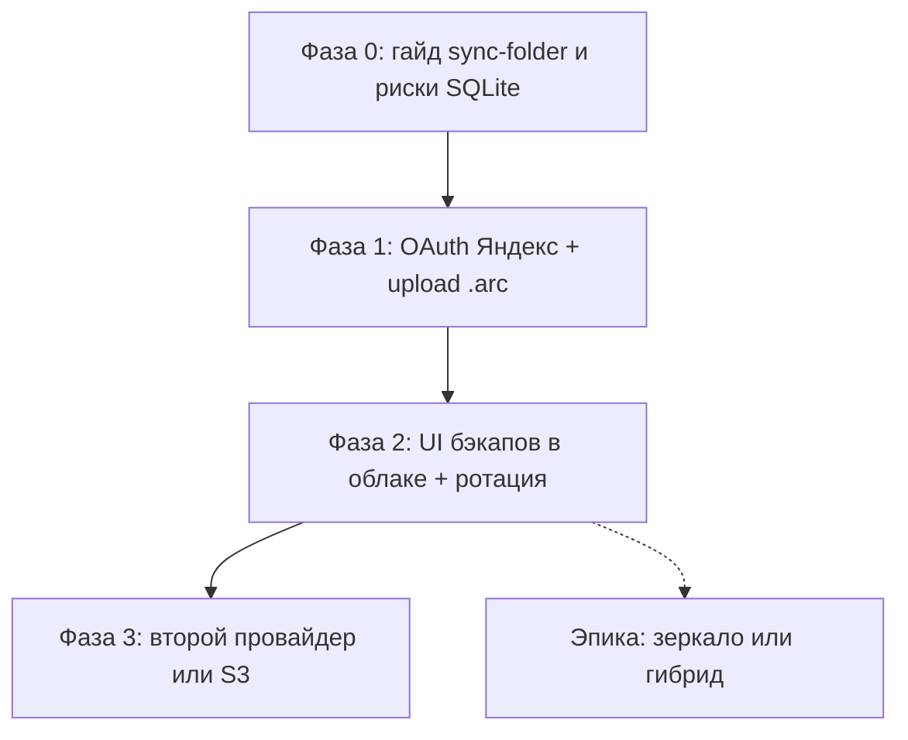

# Облачные хранилища для библиотеки ARC — исследование

**Дата:** 2026-07-19  
**Задача AnyType:** «Подключение к Яндекс Диску»  
**Ветка:** `yandex-disk-connection`  
**Ограничение этой задачи:** только исследование и рекомендации; код интеграции не пишется.

Источники API сверены на дату документа; лимиты и условия провайдеров могут меняться.

---

## 1. Executive summary

### Что ARC умеет с файлами сегодня

- Библиотека — **локальная папка** на диске пользователя (`cards/` + `meta/`).
- Путь к корню хранится в `%AppData%/ARC/library-root.json` (prod) / `…-dev/` (dev).
- Есть **ZIP-бэкап** (`.arc` / `.arc.partNN`) и восстановление, перенос папки, relink.
- **Облачной синхронизации и OAuth-интеграций нет.**

### Главный вывод

«Живая» синхронизация рабочей библиотеки через API облака **не подходит как первый шаг**: индекс `meta/arc-index.db` открыт в режиме **SQLite WAL**, sync-клиенты плохо дружат с `-wal`/`-shm` и lock-файлами. Гибрид «часть файлов в облаке» потребует смены модели путей и media server — это отдельная эпика.

Практичный путь:

1. **Сейчас (без кода продукта):** осознанное размещение корня библиотеки *или* бэкапов в папке sync-клиента + опора на существующий ZIP-бэкап.
2. **Следующая задача (код):** облако как **резервная копия** — выгрузка уже собранных `.arc` через API (для РФ-аудитории кандидат №1 — **Яндекс Диск REST API + OAuth**).
3. **Позже / не сейчас:** зеркало файлов по API, гибрид, multi-device live sync.

### Рекомендации (приоритет)

| # | Рекомендация | Усилия | Ценность |
|---|--------------|--------|----------|
| 1 | **Документировать безопасный sync-folder workflow** (библиотека или только `.arc` в папке клиента облака; риски SQLite) | S | Высокая, работает уже сейчас |
| 2 | **API upload бэкапов** — OAuth + выгрузка `.arc` на Яндекс Диск (потом опционально другие провайдеры) | M | Высокая, переиспользует `runBackup` |
| 3 | **Абстракция CloudBackupProvider** (интерфейс upload/list/download) под 2–3 провайдера | M–L | Средняя, после №2 |
| 4 | **Зеркало / гибрид** — отдельная продуктовая эпика | L+ | Высокая долгосрочно, высокий риск |

---

## 2. Контекст ARC (ограничения из кода)

### 2.1 Корень и layout

| Что | Где в коде |
|-----|------------|
| Путь библиотеки | [`src/main/libraryRootConfig.ts`](../../src/main/libraryRootConfig.ts), [`librarySessionSnapshot.ts`](../../src/main/librarySessionSnapshot.ts) → `library-root.json` |
| Имена файлов / `meta/` | [`src/main/libraryFilenames.ts`](../../src/main/libraryFilenames.ts) |
| Карточки | `cards/<id>/original.*`, `thumb_*.webp`, `card.json` — [`storage/cardFolder.ts`](../../src/main/storage/cardFolder.ts) |
| Индекс | `meta/arc-index.db` (+ `-wal`, `-shm` явно в `LIBRARY_META_BASENAMES`) |

Структура (v2):

```
<libraryRoot>/
  cards/<cardId>/…
  meta/
    arc-index.db          # SQLite
    arc-index.db-wal      # WAL (пока БД открыта)
    arc-index.db-shm
    arc-system.json
    arc-moodboard.json
    arc-history.json
    …
```

Медиа в БД и UI — **относительные** пути от `libraryRoot` (`original_rel`, …). Абсолютные пути только при импорте / «показать в проводнике» / media server.

### 2.2 SQLite WAL

В [`src/main/storage/db.ts`](../../src/main/storage/db.ts):

```ts
db.pragma('journal_mode = WAL');
```

Пока ARC запущен, рядом с `arc-index.db` живут `-wal` и `-shm`. Cloud sync, который копирует файлы по отдельности или создаёт conflict copies (`arc-index (1).db`), **может повредить индекс** или оставить рассинхрон между БД и файлами в `cards/`.

Бэкап это учитывает: [`runBackup`](../../src/main/backupLibrary.ts) вызывает `closeLibraryDb()` **до** упаковки файлов.

### 2.3 Уже есть: ZIP-бэкап

- UI: [`SettingsBackupPanel.tsx`](../../renderer/src/pages/settings/panels/SettingsBackupPanel.tsx)
- Логика: [`backupLibrary.ts`](../../src/main/backupLibrary.ts) / [`restoreLibrary.ts`](../../src/main/restoreLibrary.ts)
- Формат: `ARC_YYYY-MM-DD.arc` или `.arc.part01`… (1/2/4/8 частей), внутри ZIP + `manifest.json` с SHA256
- Содержимое: `meta/`, `cards/`, legacy `media/` и корневой индекс при необходимости

Это **готовый артефакт** для выгрузки в облако без изменения модели путей.

### 2.4 Чего нет

- OAuth / cloud credentials в preferences
- Фоновая синхронизация с облаком
- Удалённое чтение `original` без локальной копии (media server всегда смотрит в `libraryRoot`)

---

## 3. Четыре сценария из задачи

### 3.1 Библиотека в папке sync-клиента облака

Пользователь указывает корень библиотеки внутри «Яндекс Диск», «OneDrive», «Dropbox» и т.п. ARC не знает про облако — синхронизирует клиент ОС.

| | |
|--|--|
| **Плюсы** | Нулевой код в ARC; работает с любым провайдером с desktop-клиентом; путь уже настраивается в «Настройки → Библиотека» |
| **Минусы** | Нет контроля конфликтов; два ПК с открытым ARC одновременно опасны; WAL + sync = риск повреждения БД |
| **Риски для ARC** | Conflict copies индекса; частичная синхронизация `cards/` vs `meta/`; Files On-Demand (OneDrive) — «файл только в облаке» ломает чтение медиа |
| **Вердикт** | Допустимо как **осознанный** workflow: один активный ПК; желательно исключать `meta/*.db*` из sync или бэкапить через `.arc`; не позиционировать как «официальную синхронизацию» без гайда |

### 3.2 Облако как резервная копия

Пользователь (или ARC) кладёт в облако **снимки** библиотеки — в первую очередь готовые `.arc`.

| | |
|--|--|
| **Плюсы** | Согласуется с текущей архитектурой; бэкап уже закрывает БД; атомарный снимок лучше живого зеркала; restore уже есть |
| **Минусы** | Не «живая» библиотека на втором устройстве без restore; большие архивы; нужна политика ротации |
| **Риски** | Утечка токена OAuth; квоты/скорость API; WebDAV Яндекса плохо тянет крупные файлы — для больших `.arc` нужен REST |
| **Вердикт** | **Рекомендуемый продуктовый первый шаг** после документации |

### 3.3 Зеркальное копирование файлов библиотеки в облако

ARC (или внешний job) копирует `cards/` + `meta/` 1:1 в облако по API, без обязательного ZIP.

| | |
|--|--|
| **Плюсы** | Инкрементальные upload; теоретически быстрее полного `.arc` при малых изменениях |
| **Минусы** | Нужен свой sync-engine (diff, retries, порядок meta vs cards); те же риски WAL при чтении live DB; conflict resolution |
| **Риски** | Сложность ≈ мини-Dropbox внутри Electron; баги = потеря данных |
| **Вердикт** | **Не первый шаг.** Имеет смысл только после стабильного backup-upload и чёткого product brief |

### 3.4 Гибрид: часть локально, часть в облаке

Часть `original` только в облаке; локально thumbs / «холодное» хранилище.

| | |
|--|--|
| **Плюсы** | Экономия диска; «библиотека больше локального SSD» |
| **Минусы** | Ломает текущую модель: media server, integrity check, offline, бэкап, AI-индексация |
| **Риски** | Нужны `storage_tier`, lazy fetch, очередь скачивания, UX «файл недоступен» |
| **Вердикт** | **Отдельная эпика**, не в scope ближайших фаз |

---

## 4. Сравнение провайдеров

Оценка для **desktop Electron-приложения** (OAuth или sync-клиент без API).  
Шкала: хорошо / средне / слабо / нет данных.

| Провайдер | Открытый API / OAuth для desktop | Sync-клиент без API | WebDAV | РФ-доступность (типично) | Пригодность для `.arc` upload | SQLite в sync-папке | Заметки |
|-----------|----------------------------------|---------------------|--------|--------------------------|-------------------------------|---------------------|---------|
| **Яндекс Диск** | Хорошо — [REST API](https://yandex.ru/dev/disk/rest/), OAuth (`cloud_api:disk.*`) | Есть официальный клиент | Есть; **крупные файлы лучше через REST** (WebDAV троттлит) | Хорошо | Хорошо | Рискованно (как у всех) | Кандидат №1 для API-бэкапа в RU |
| **Google Drive** | Хорошо — Drive API v3, OAuth 2 | Drive for desktop | Нет как основной путь | Средне / зависит от региона | Хорошо | Рискованно | Сильный API; для RU может быть хуже UX аккаунта |
| **OneDrive** | Хорошо — Microsoft Graph | Встроен в Windows | Нет как основной | Средне | Хорошо | Рискованно + **Files On-Demand** | Удобно на Win; осторожно с placeholder-файлами |
| **Dropbox** | Хорошо — Dropbox API | Зрелый клиент | Нет | Средне | Хорошо | Рискованно | Хороший sync UX; API зрелый |
| **MEGA** | Средне — SDK / community JS; E2E crypto | Есть клиент | Нет | Средне | Средне | Рискованно | Privacy-плюс; интеграция тяжелее (ключи, неофициальные обёртки) |
| **Облако Mail** | Слабо — **официального публичного REST для приложений нет**; WebDAV + пароль приложения | Есть клиент | Да ([help](https://help.mail.ru/cloud/desktop/webdav/)) | Хорошо | Средне (WebDAV, лимиты) | Рискованно | Для in-app API — плохой кандидат; как sync-folder — ок |
| **Self-hosted (S3 / WebDAV / Nextcloud)** | Хорошо (S3/WebDAV) при своей инфраструктуре | Зависит от ПО | Часто да | Зависит | Хорошо для tech-аудитории | Рискованно | Не default; опциональный провайдер «для продвинутых» |

### 4.1 Яндекс Диск (детали для фазы 1)

- Документация: [REST API Диска](https://yandex.ru/dev/disk/rest/)
- OAuth: регистрация приложения на [oauth.yandex.ru](https://oauth.yandex.ru/), scopes вроде `cloud_api:disk.read`, `cloud_api:disk.write`, опционально `cloud_api:disk.app_folder`, `cloud_api:disk.info`
- Upload: `GET …/resources/upload?path=…` → `PUT` на выданный URL
- Download: `GET …/resources/download?path=…` → скачивание по ссылке
- Для крупных `.arc` предпочитать REST, не WebDAV
- В Electron: PKCE / loopback redirect или device-friendly flow — уточнить при реализации (открытый вопрос)

### 4.2 Почему не multi-provider сразу

Один провайдер (Яндекс) закрывает основной RU-кейс и проверяет UX «бэкап в облако». Интерфейс `CloudBackupProvider` можно заложить сразу, вторую реализацию (Drive / S3) — после стабилизации.

---

## 5. Рекомендация

### Что делать первым

**Сценарий 3.2 (облако = резервная копия), подготовленный сценарием 3.1 (документация).**

1. **Фаза 0 — документация / help (можно в KB, без кода облака)**  
   - Можно ли положить корень библиотеки в папку Яндекс Диска / OneDrive / Dropbox.  
   - Риски: не открывать ARC с двух ПК одновременно; Files On-Demand; не полагаться на sync как на бэкап.  
   - Предпочтительный безопасный путь уже сейчас: **регулярный `.arc` бэкап** в папку, которую синхронизирует клиент облака (даже без OAuth в ARC).

2. **Фаза 1 — следующая задача на код**  
   - После `runBackup` (или выбор существующего `.arc`) — upload в папку приложения на Яндекс Диске.  
   - Список бэкапов в облаке, скачивание → существующий restore.  
   - Токены — в secure storage ОС / encrypted preferences, не в `library-root.json`.

3. **Не начинать с** зеркала файлов и гибрида.

### Почему не «сразу гибрид / API-зеркало»

- Относительные пути и `arc-media://` заточены под один локальный корень.
- Integrity / AI / бэкап предполагают локальные файлы.
- SQLite WAL делает live-sync опасным без snapshot-протокола (который уже есть в виде `.arc`).

---

## 6. Дорожная карта (вне этой задачи)



| Фаза | Содержание | Код в ARC |
|------|------------|-----------|
| 0 | Help / KB: sync-folder, риски WAL, «бэкап `.arc` в папку облака» | Нет или только docs/KB |
| 1 | OAuth Яндекс Диск, upload/download `.arc`, минимальный IPC | Да |
| 2 | Настройки: «Сохранить бэкап в облако», список, ротация, ошибки квоты | Да |
| 3 | Абстракция провайдеров + Drive или S3/WebDAV | Да |
| X | Зеркало / гибрид — отдельный ADR и эпика | Да, крупно |

---

## 7. Открытые вопросы (перед кодом фазы 1)

1. **Аудитория:** доля пользователей с Яндекс ID vs Google/Microsoft — подтвердить аналитикой/опросом беты.
2. **OAuth app:** кто регистрирует приложение Яндекса (юрлицо / физлицо), redirect URI для Electron, нужен ли `disk.app_folder` вместо полного `disk.write`.
3. **Размер библиотек:** типичный размер `.arc` (нужны ли multipart / resume upload).
4. **Политика хранения:** сколько копий в облаке, авто-upload после локального бэкапа или только вручную.
5. **Юридика / ToS:** хранение пользовательских медиа на чужом Диске через наше приложение — формулировки в политике.
6. **Self-hosted:** нужен ли S3 как «продвинутый» провайдер в v1 API-бэкапа или только после Яндекса.

---

## 8. Вне scope текущего документа / ветки

- Регистрация OAuth-приложения
- Изменения в `src/`, `renderer/`, IPC
- Spike-прототип загрузки
- Реализация гибрида или live-sync

---

## 9. Ссылки

- [Яндекс Диск REST API](https://yandex.ru/dev/disk/rest/)
- [OAuth Яндекса](https://oauth.yandex.ru/)
- [Google Drive API](https://developers.google.com/drive/api/guides/about-sdk)
- [Microsoft Graph — OneDrive](https://learn.microsoft.com/en-us/graph/api/resources/onedrive)
- [Dropbox API](https://www.dropbox.com/developers/documentation)
- [Облако Mail — WebDAV](https://help.mail.ru/cloud/desktop/webdav/)
- Внутренний образец research: [`docs/ai/local-agent-research.md`](../ai/local-agent-research.md)
