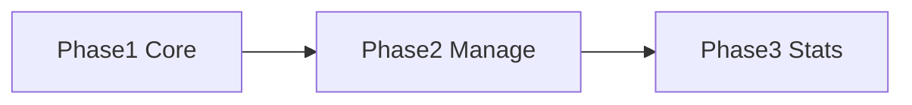

# План: несколько библиотек

**Ветка:** `multiple-libraries`  
**Коммит с реализацией:** `12e57a7`  
**AnyType:** задача «Несколько библиотек» (`bafyreicpl7237an5ijcnekql2pbjukb7jmkt6t4ypbf7v35sfbzfxfgygm`)  
**Статус фаз 1–3:** реализованы в коде (см. ниже «Что сделано» / «Что осталось»)

Документ нужен, чтобы продолжить работу на другом устройстве: `git fetch && git checkout multiple-libraries`, затем открыть этот файл.

---

## Продуктовые решения (зафиксированы)

| Тема | Решение |
|------|---------|
| Контейнер | Папка `Библиотека ARC` (ед. число); внутри — дочерние библиотеки |
| Структура | `<parent>/Библиотека ARC/<Имя>/meta`, `cards` |
| Конфиг | `library-root.json`: `parentPath`, `activeLibraryId`, `libraries[{id,name,path}]`, `path` = active |
| Миграция legacy self-named | Модалка имени → wrap в контейнер |
| Миграция иначе | Рядом создать `Библиотека ARC`, перенести папку с тем же именем |
| Вне контейнера | Запрещено открывать/создавать |
| Open контейнера (чистый ПК) | Active = первая по имени (А→Я) |
| Hot-switch | Без рестарта; лёгкий dim; URL (корзина/фильтры) сохранять |
| Navbar | Список библиотек + создать; не scope |
| Корзина | Бургер + счётчик; «Очистить» только в UI trash |
| Метки | Фильтр Всё / С метками / Без меток; сайдбар меток как был |
| Rename | Только rename папки на диске |
| Delete | Диск / отвязать; нельзя удалить последнюю; после active → соседняя |
| Бэкап/restore UI | Убрать; перенос = папка пользователем |
| Статистика | При 2+ — табы «Все» + имена |
| Auto-import | Отдельный путь на каждую библиотеку; watch только active |
| Иконка Windows | Только на родительскую |
| Docs GitBook | Отдельная задача |

---

## Целевая модель

```text
<user-chosen-dir>/Библиотека ARC/<Имя библиотеки>/
  meta/
  cards/
```

Ключевые файлы main:

- [`src/main/multiLibrary.ts`](../../src/main/multiLibrary.ts)
- [`src/main/librarySessionSnapshot.ts`](../../src/main/librarySessionSnapshot.ts)
- [`src/main/libraryRootConfig.ts`](../../src/main/libraryRootConfig.ts)
- [`src/main/libraryContainer.ts`](../../src/main/libraryContainer.ts)
- [`src/main/libraryNameValidation.ts`](../../src/main/libraryNameValidation.ts)
- [`src/main/ipc.ts`](../../src/main/ipc.ts) — list/create/switch/open/rename/delete/migrate/wrap

Renderer:

- `NavbarLibrarySwitcher`, `NavbarMenu` (корзина), `GalleryTrashToolbar`
- `LibraryWrapMigrationHost` / `Modal`, `LibrarySwitchDimOverlay`
- `SettingsLibraryPanel`, `LibraryManageModal`, `useSettingsLibraries`
- `SettingsStatisticsPanel` (табы), auto-import per library
- фильтр `tagPresence` в `galleryFilterCore` + `GalleryNavbarFilters`

---

## Фазы



| Фаза | Содержание | Статус |
|------|------------|--------|
| 1 | Конфиг, миграция, IPC switch/create, dim, navbar, корзина, фильтр меток, онбординг | Done |
| 2 | Settings-список, rename/delete, перенос родителя, auto-import per lib | Done |
| 3 | Табы статистики, удаление backup/restore из UI/preload | Done |

---

## Что сделано

- Реестр библиотек + миграция legacy + wrap-modal
- Hot-switch без рестарта + dim overlay
- Navbar: библиотеки + создание; корзина в бургер; trash toolbar
- Фильтр наличия меток; legacy `?lib=untagged` → tagPresence
- Онбординг под контейнер; restore убран из онбординга/UI
- Settings: список как сайдбар меток, manage modal, перенос контейнера
- Auto-import: `autoImportByLibraryId`, watcher на active
- Статистика: табы при нескольких библиотеках (агрегат счётчиков; диск/детали — у активной)
- Backup panel / PendingRestore / preload backup API убраны из renderer

Проверки на момент сдачи: `npm test` OK, `verify:renderer-ui` OK.

---

## Что осталось / follow-up

1. **Ручной smoke** на реальных данных (миграция, 2+ библиотеки, trash, rename/delete, auto-import).
2. **Статистика:** для неактивной вкладки полный диск/метки не агрегируются по всем корням — при необходимости доработать IPC без hot-switch приложения.
3. **Main IPC** backup/restore handlers в `src/main` могут ещё лежать как мёртвый код — вычистить отдельным коммитом по желанию.
4. **GitBook / тестерские гайды** — отдельная задача.
5. **AnyType:** закрыть карточку после merge (`anytype-task-finish` / «закрой задачу»).

---

## Как продолжить на другом устройстве

```bash
git fetch origin
git checkout multiple-libraries
# если ветка ещё не на remote — сначала push с машины, где есть коммит:
# git push -u origin multiple-libraries
```

В Cursor: открыть этот файл + ветку `multiple-libraries`.  
Сессия AnyType: object id выше; тип `task`.

Команды: «продолжи smoke / доработай статистику / закрой задачу» и т.п.
